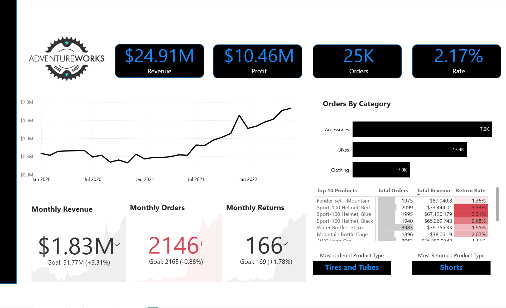
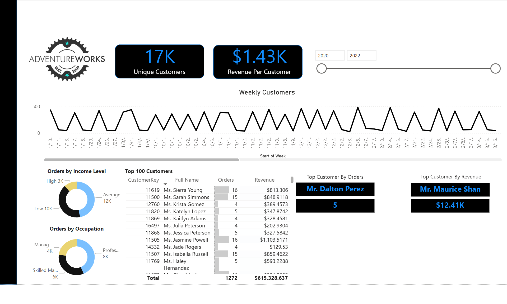
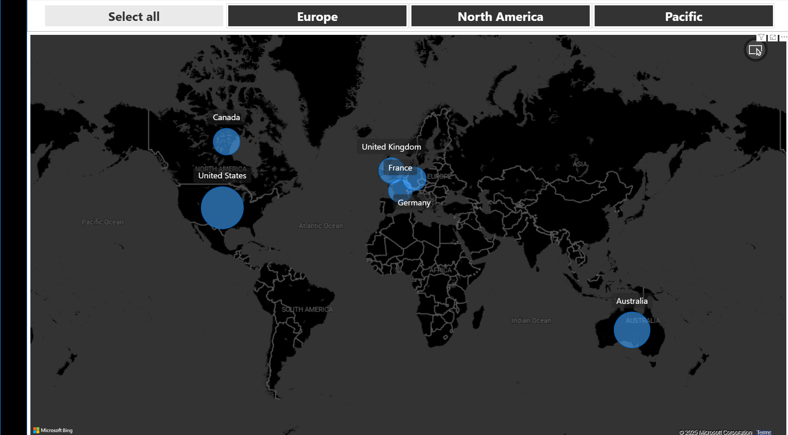
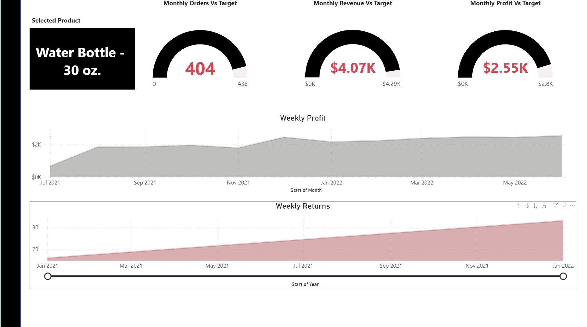

# retail-sales-performance-dashboard

## Overview
This project focuses on analyzing retail sales data to generate insights across revenue, customer behavior, and product performance. A multi-page Power BI dashboard was developed to provide a complete view of business performance, enabling data-driven decision-making.

## Business Objective
The goal of this project was to simulate a real-world business analytics scenario by transforming raw transactional data into actionable insights for sales optimization, customer analysis, and performance tracking.

## Tools & Technologies
- Power BI
- Microsoft Excel
- DAX (Data Analysis Expressions)

## Dashboard Pages
- Executive Performance Summary: High-level KPIs and business insights
- Sales Overview: Revenue, profit, orders, and category performance
- Product Analysis: Orders, profit, returns, and product trends
- Customer Insights: Segmentation, top customers, and revenue per customer

## Key Metrics Tracked
- Revenue
- Profit
- Total Orders
- Return Rate
- Revenue per Customer
- Monthly Targets vs Actual Performance

## Key Insights
- Identified top-performing product categories driving revenue growth
- Analyzed return patterns to highlight potential product issues
- Segmented customers based on income and occupation for targeted strategies
- Evaluated performance against targets to identify gaps and opportunities

## Business Impact
This dashboard helps businesses:
- Monitor performance across multiple dimensions
- Identify growth opportunities in products and customer segments
- Improve decision-making using data-driven insights
- Optimize sales and marketing strategies

## Screenshots
## Dashboard Preview

### Sales Overview

### Customer Dashboard

### Map Summary

### Product Dashboard

## How to Use
1. Download the `.pbix` file
2. Open in Power BI Desktop
3. Navigate through dashboard pages using tabs

## Future Improvements
- Add forecasting for sales and demand trends
- Integrate real-time data sources
- Enhance customer segmentation with behavioral data
